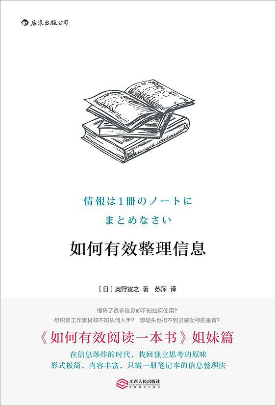

# 我读这本书的目的

* 了解怎么整理信息

# 目前从书里对生活工作的帮助
* 坚持做笔记
* 阅读美国国家地理

# 读后感
这本书是买如何有效阅读一本书顺带买的。那个是一套一系列的。但是和另一本书重复的内容太多，其实这本书不怎么样。

# ReadingNotes
>知识生产即产出新知识 P003

**读书只是吸收知识，记忆知识，要灵活掌握并且输出才是知识生产。**

>“分类整理”本身是件有意义的事情，对学者和记者来说也是必要的工作，但是不适合推荐给普通人。因为普通人虽然不至于绝对办不到，但是的确无法坚持下去。其结果是，以往的知识生产技术会沦为纸上谈兵。P004

**太过麻烦而导致积极性下降的方式是不可行而且不可取的，会对学习产生排斥的想法，进而放弃终止。要快乐的学习。**

> 因为简单，所以效果值得期待。P006

**简单不代表低效果，快速便捷的方式值得期待。**

>笔记本不像手账，无须一年换一册新的。趁用完的一个适当时机，你可以进行多次更替。因此，坚持使用这种方式的话，你可能会萌生“尺寸更大的可能更好吧”“或许还是硬皮的好用一些吧”等念头，经过反复尝试和失败，适合自己风格的使用方法会得到自动优化，继续使用。P012

**学习方法是在实践中反复修改以达到最高的效果。要不断的摸索探索，反思调整。**

>简言之，因为你需要的信息就在笔记本里，所以你才会想到要参考它，笔记本中没有的内容你甚至都想不起来。P008

**目前也在晚上自己的知识储备。**

>倘若是为了加深业务知识，或许搜集自己行业的相关报道比较好。但在知识生产方面，其实像这样不断接触乍看上去毫无关联的信息才是上策。P019

**接触全面的知识有助于视野开阔，发散思维。**

>我现在使用的笔记本是第 189 册了，可见，到目前为止的 10 年间，我已经更换了 188 次笔记本。P044

**作者的坚持也是令人吃惊。**

>而且持续使用相同的东西，人们不免会感到厌倦。多体验几次新鲜感，会给你带来意外的收获。P045

**我是一个很怀旧的人，喜欢用旧的东西，习惯的东西。因为用着顺手，除非是很不好用了。不然不会更换。**

>看到陈列在书架上的大量笔记，我会有一种“我已经生活这么久了”的感觉，这是种非常不可思议的充实感。与“工作 3 年”“学习了 1 000 个小时”等具体数字稍有不同，我看到的是成堆的笔记这样亲眼可见的数量，这实打实地令我感到满足。P081

**除了电子版，打印自己总结的东西，也可以有成就感。**

>我想推荐大家回顾一些比较老的笔记，不要带任何目的，只是随意地翻翻看。 你看到曾经自己憧憬或喜欢的东西时，一定会思绪万千。 
>“我性格倔强这一点倒是完全没变啊。” 
>“即便是现在，我还是说着同样的话。” 
>“现在做的工作完全不一样了，但本质上是相通的。”
> 反复认识到这些情况后，你就会知道在之后的人生中要做什么，以及自己真正喜欢的事物是什么。你想读的书、想进修的领域、想表达的话语会慢慢变得明确。这些东西，从广义上讲不也算得上知识生产吗？P122

**翻看自己以前的笔记，日记也是有这种的感悟，很多事想了很多年了，不要给自己留下遗憾。**

>在工作中，即便没有得到成果，也要毫不气馁地做下去。特别是在市场不景气的时候，做什么都看不到未来，即便如此，也必须保持那份工作热情，哪怕屡战屡败。 如果没有生活日志，你也许只会记得不尽如人意的结果，甚至会记忆模糊；但如果用生活日志的话，你可以亲眼看到自己曾经的努力和辛苦，即便没有任何结果，曾经的努力也会成为自己内心的支柱。P124

**付出了不一定会有收获，全力去做了，失败也可以总结教训，不要对过去一直悔恨，过去的经验教训是为了未来指明方向和道路。**

>那么，如果还有余力，比如已经积累了一定量的笔记，想用它来生产知识的时候，我建议首先不带有任何目的性地重读。你可能很难一开始就做到“无目的性”。P150

**笔记写完也是杂乱无章需要整理和回顾。**

>重读笔记时，不要僵化地接受上面写的内容，而要带着如何将其运用到现在处理的工作上的视角去看。P151

**重读笔记也是为了有所收获。**

> 重读笔记中的素材时，可以写下更多的想法。也就是以不同视角去观察同一个事物。这时，还有可能发掘出与记笔记时完全不同的想法。P153

**重读笔记的自己已经不是当年的自己，一些想法已经改变。**

> 即便是同样的笔记和资料，每次阅读时的感受都会发生变化。直接记下这个不同点，或者在资料的其他部分画线，便可让思绪慢慢地“匍匐前进”。通过这种加工方式，你就可以从写的满满的笔记中一点点获取有使用价值的点子了。P155

**因为读的人自己发生了改变了。想法也会发生改变。**

# Reading History
2018年10月14日读完
2018年10月21日星期日做完笔记