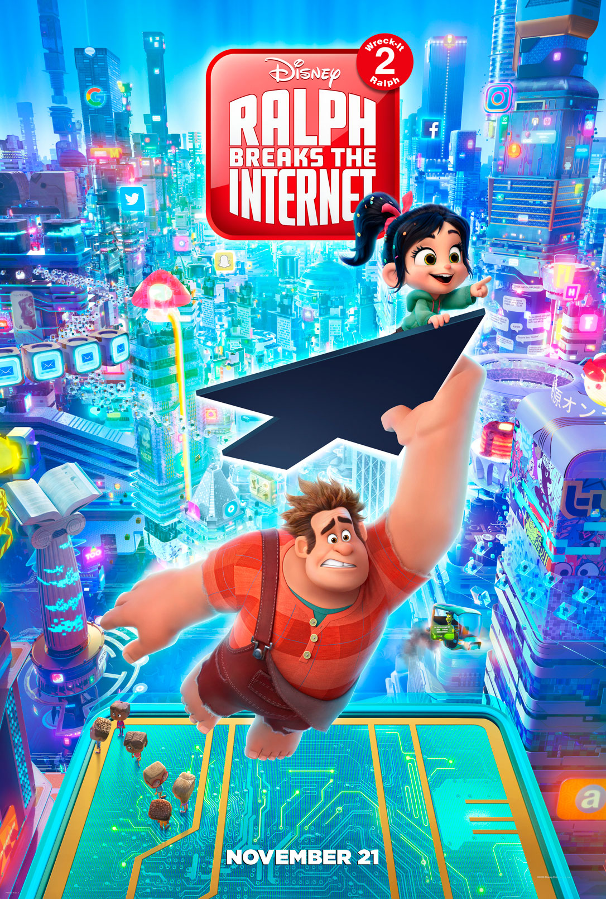

Ralph是个大块头，头脑简单，四肢发达，心地善良。他喜欢街机厅日复一日的生活，期待生活稳定，能和Vanellope在一起他就很满足了。
Vanellope是一个喜欢挑战，冒险的人，她不喜欢平平淡淡的生活，期待未知的未来，不满足于按既定的节奏里生活。
这是两种不同价值观和世界观的两个人。所以他们在后面产生了分歧。
但是好朋友不一定要有一样的世界观和爱好。这需要大家互相体谅包容。
我喜欢Vanellope那种探索，尝试生活不同可能的追求。
喜欢一个人不一定要占用对方，好朋友也不一定只能和你一个人做好朋友。人与人之间的人际交往都是全面的，多元化的。
所以好朋友的好朋友，也可能成为大家的好朋友。
做人不能太狭隘和小气。
